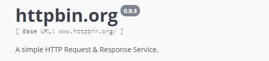

# Python爬虫

## 环境

> **Python+Pip**、**MongoDB、Redis、Mysql**

## 基本原理

**获取数据**

> 网页文本、图片、视频、其他

**解析方式**

> 直接处理、Json解析、正则表达式、BeautifulSoup、PyQuery、XPath

**javascript渲染问题**

> 分析Ajax请求、Selenium/WebDriver、Splash、PvV8、Ghost.py

**数据保存**

> 文本、关系型数据库、非关系型数据库、二进制文件

## 常用库

> **urllib**、**requests**、**selenium**、**phantomjs**、**lxml**、**beautifulsoup4**、**pyquery**、**pymysql**、**pymongo**、**redis**、**flask**、**django**、**jupyter**

### Urllib

​	Python内置的HTTP请求库

| 模块               | 含义               |
| ------------------ | ------------------ |
| urllib.request     | 请求模块           |
| urllib.error       | 异常处理模块       |
| urllib.parse       | url解析模块        |
| urllib.robotparser | robots.txt解析模块 |

### Requests

### Selenium