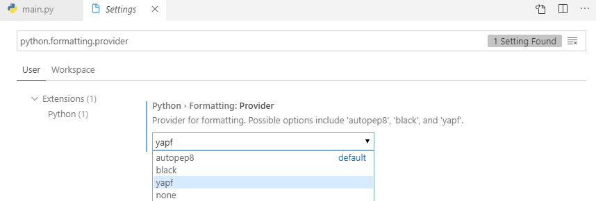

## 配置镜像

windows下： 新建`C:\Users\Administrator\pip\pip.ini`，填写下面内容，保存即可

```shell
[global]  
index-url=http://mirrors.aliyun.com/pypi/simple/  
[install]  
trusted-host=mirrors.aliyun.com  
```

## 开发配置

#### 代码格式化-vscode

`pip install yapf`

File—Preferences—Settings，搜索python.formatting.provider，选择yapf



## 安装库

`pip install requests`

`pip install pyquery `

`pip install HTMLParser`